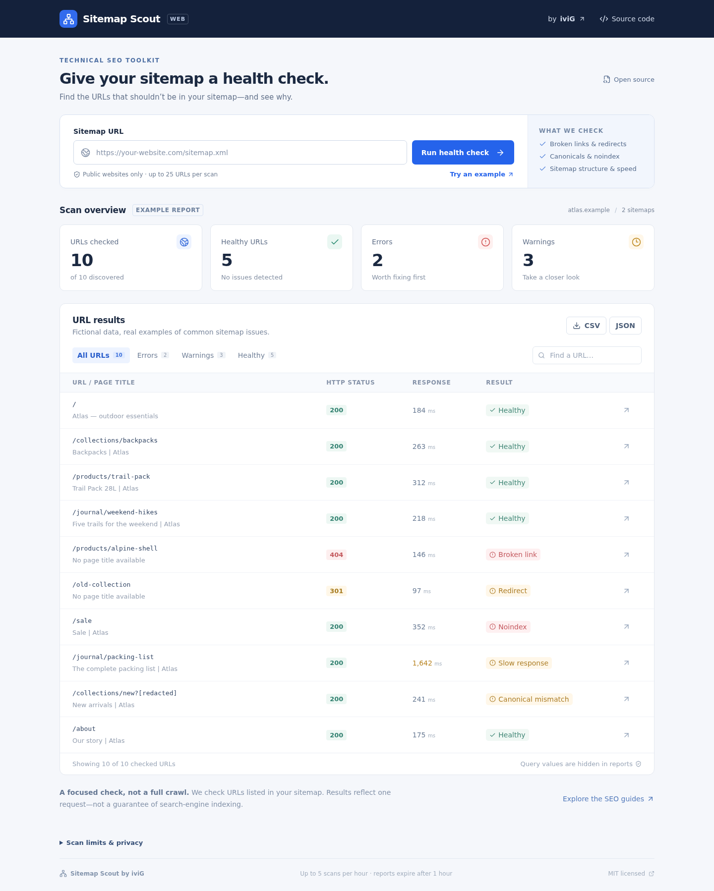

# Sitemap Scout Web

A small, self-hosted sitemap health checker. Paste a sitemap URL, watch the scan progress, inspect the problems, and export a CSV or JSON report.

**[Use the public tool](https://scout.ivig.dev)** · [CLI edition](https://github.com/MilanG-Ne/sitemap-scout) · [Deployment guide](docs/deployment.md)



## What it checks

- Sitemap XML, gzip files, nested indexes, duplicates, and `lastmod` dates.
- Broken URLs, redirects, HTTP errors, and responses slower than one second.
- HTML titles, canonical mismatches, multiple canonicals, and `noindex` directives from HTML or HTTP headers.
- Explicit coverage warnings when a scan stops early or hits a limit.

The dashboard includes filters, URL/title search, keyboard-accessible detail dialogs, stop controls, and CSV/JSON downloads. The example report uses fictional `atlas.example` data; loading it never contacts a website.

## Why this architecture

React and TypeScript handle the interface; a dependency-free PHP 8.2+ API performs the network requests. A scan advances through short browser-driven requests, with at most one outbound fetch in each step. It fits ordinary shared hosting without a queue worker, database, Node server, external API, or cron job. Keep the browser tab open during a scan.

The parsing and URL handling started from [Sitemap Scout v0.1.0](https://github.com/MilanG-Ne/sitemap-scout/tree/v0.1.0), also MIT licensed. This web edition adds a stricter network boundary, bounded private jobs, anonymous quotas, HTML inspection, and the interactive report.

## Run locally

Requirements: Node 24+, pnpm 11, PHP 8.2+ with `curl`, `dom`, `filter`, `json`, and `zlib`. Python 3 is needed only to create release archives.

```sh
pnpm install --frozen-lockfile
cp config.example.php config.php
# In config.php, set origin to http://127.0.0.1:3003
php -S 127.0.0.1:8083 -t public
```

In a second terminal:

```sh
pnpm dev
```

Open `http://127.0.0.1:3003`. Vite proxies the PHP API. The private `var/` directory is created automatically; both it and `config.php` are ignored by Git. Without a configured API, the example report still works.

## Tests and release package

```sh
php backend/tests/run.php
pnpm test
pnpm build
pnpm exec playwright install chromium
CI=1 pnpm test:e2e
pnpm package
```

Browser tests use isolated API responses; the PHP suite tests actual engine/API/storage behavior and cURL against a local HTTP fixture. By default local browser runs use installed Chrome; `CI=1` uses Playwright's Chromium. CI runs PHP 8.2/8.4, frontend tests, browser checks, and builds the hosting archive. No credentials or live scans are required for tests.

`release/sitemap-scout-web.tar.gz` includes only the production PHP code and built public assets. Configuration, job data, tests, Git metadata, and dependencies are excluded by an explicit allowlist. Set the hosting document root to **`public/`**, never the project root. See [deployment and rollback](docs/deployment.md).

## Deliberate limits

| Limit | Public default |
| --- | --- |
| URLs checked | 25 unique URLs |
| Sitemap documents | 3, including the starting index |
| Entries considered | 2,000 per document |
| Sitemap bytes | 1 MiB, including after decompression |
| HTML bytes | 256 KiB |
| Request timeout | 8 seconds |
| Page redirects | Reported, not followed |
| Sitemap redirects | Up to 3 hops, same origin |
| Active scans | 3 across the installation |
| Scan allowance | 5/IP/hour, 20/IP/day, 150/day globally |
| Maximum scan duration | 15 minutes |
| Report access | Expires one hour after creation |

Quotas use UTC calendar hours/days, not rolling windows. Inactive scan slots expire after 60 seconds. Completed/expired files are cleaned up opportunistically on later scan activity, so expired files can remain on an idle server until the next scan. Limits live in `backend/src/Limits.php`.

A result describes one HTTP request, not search-engine indexing. No JavaScript is executed on scanned pages. Canonicals and robots signals are read from the HTML response; `robots.txt` rules, rendered metadata, hreflang, and full-site crawling are outside this version's scope. Metadata beyond the byte limit may be missing. Cross-origin sitemap entries (including a different scheme, port, or `www` host) are skipped and reported. Use the final sitemap origin to avoid these exclusions.

## Privacy and operation

Only submit public URLs. Query values are hidden in returned reports, but full submitted URLs are held temporarily in private server-side scan state so requests can be made. URL paths and page titles remain visible; redaction is not a guarantee that arbitrary website content contains no sensitive information. The operator's normal hosting logs and backups have their own retention.

Reports require an unguessable scan ID and a separate bearer token. Tokens stay in browser memory, are not written to browser storage or report files, and only token hashes are stored on the server. The quota ledger stores keyed IP hashes rather than raw addresses. There are no accounts, analytics scripts, cookies, paid API integrations, or automatic report sharing.

The public API validates and pins public DNS addresses, blocks local/reserved networks, restricts ports, verifies TLS, bounds responses, and does not forward user headers or cookies. Same-origin POST validation is an additional browser safeguard; it is not authentication and does not prevent a determined bot. Quotas bound outbound scans, not total inbound traffic. Existing hosting CPU, bandwidth, and account limits still apply. Disable new API work by setting `enabled` to `false` in `config.php`.

See [SECURITY.md](SECURITY.md) for the threat boundary and reporting process. Contributions are welcome through issues and pull requests; include a regression test when changing the parser, network guards, or job state machine.

MIT licensed.
